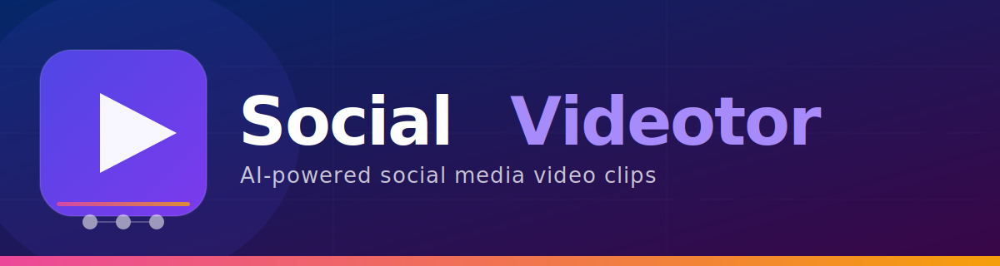

# SocialVideotor

<p align="center">
  
</p>

<p align="center">
  
</p>

---

## About

**SocialVideotor** is a Blazor web application that helps content creators and marketers transform long-form videos into platform-ready short clips. Powered by AI, it analyses your footage, surfaces the most engaging moments, and lets you add text overlays before exporting directly to TikTok, Instagram, YouTube, and Facebook.

## Features

- 🎬 **AI video analysis** — automatically identifies key moments in your footage
- ✂️ **Clip editor** — trim, arrange, and annotate clips with text tiles
- 📱 **Multi-platform export** — tailor clips to the format specs of every major social network
- 🚀 **Fast workflow** — go from raw upload to publish-ready clip in minutes

## Tech Stack

- [ASP.NET Core Blazor](https://dotnet.microsoft.com/apps/aspnet/web-apps/blazor) (server-side interactive)
- [Microsoft Fluent UI Blazor](https://www.fluentui-blazor.net/) component library
- C# / .NET 9

## Getting Started

```bash
# Restore dependencies and run
cd SocialVideotor
dotnet run
```

Then open your browser at `https://localhost:5001`.

## Branding

| Asset | Path |
|-------|------|
| Square logo (512 × 512) | `SocialVideotor/wwwroot/logo.svg` |
| Horizontal banner (1200 × 320) | `SocialVideotor/wwwroot/logo-banner.svg` |
| Favicon (32 × 32) | `SocialVideotor/wwwroot/favicon.svg` |

### Colour Palette

| Role | Hex |
|------|-----|
| Brand Indigo | `#4F46E5` |
| Brand Violet | `#7C3AED` |
| Accent Lavender | `#A78BFA` |
| Accent Pink | `#EC4899` |
| Background Dark | `#052769` → `#3A0647` |
